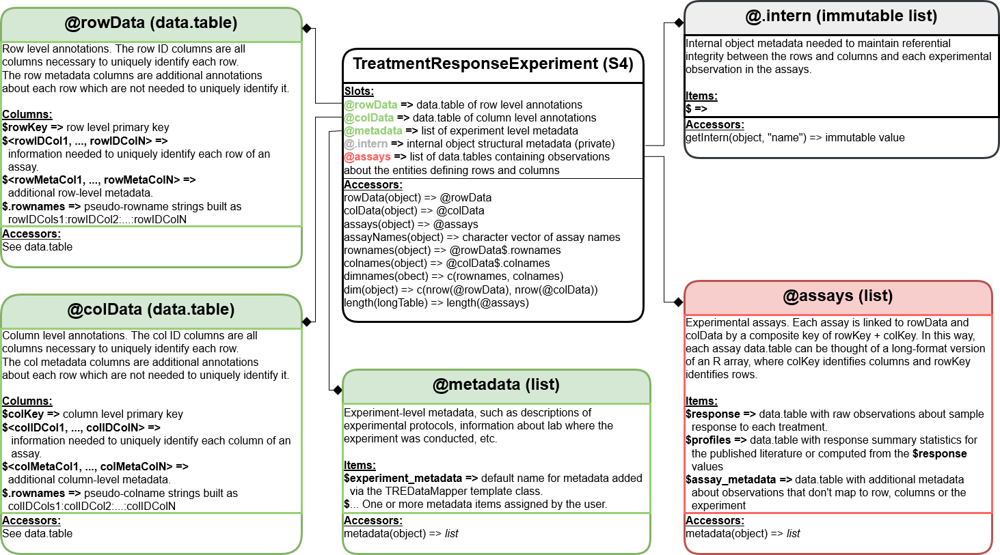

```{r setup, include=FALSE}
library(formatR)
knitr::opts_chunk$set(echo=FALSE)
```

```{r dependencies, include=FALSE}
library(CoreGx)
library(data.table)
```

# Why Do We Need A New Class?

The current implementation for the `@treatmentResponse` slot in a
`PharmacoSet` has some limitations.

Firstly, it does not natively support dose-response experiments with
multiple drugs and/or cancer cell lines. As a result we have not been
able to include this data into a `PharmacoSet` thus far.

Secondly, drug combination data has the potential to scale to high dimensionality.
As a result we need an object that is highly performant to ensure
computations on such data can be completed in a timely manner.

To resolve these issues, we designed and implement the
`TreamtentResponseExperiment` (or `TRE` for short)!

# Design Philosophy

The current use case is supporting drug combinations experiments in
`r BiocStyle::Biocpkg("PharmacoGx")`, but we wanted to create something flexible
enough to fit other use cases. As such, we have used the generic term
'treatment' to refer to any experimental intervention one can conduct on a
set of samples. In context of `r BiocStyle::Biocpkg("PharmacoGx")`, a
treatment represents application of one or more anti-cancer compounds to a
cancer cell-line. The resulting viability for this cell-line
after treatment is the response metric. We hope that the implementation of
our class is general enough to support other use cases. For example, the
`TreatmentResponseExperiment` class is also being adopted for radiation
dose-response experiments in cancer cell-lines in
`r BiocStyle::Biocpkg("RadioGx")` as well as for investigating compound
toxicity in healthy human and rat cell-lines in
`r BiocStyle::Biocpkg("ToxicoGx")`.

Our design takes the aspects of the `SummarizedExperiment` and
`MultiAssayExperiment` classes and implements them using the `data.table`
package, which provides an R API to a rich set of tools for scalable,
high performance data processing implemented in C.

# Anatomy of a TreatmentResponseExperiment

## Class Diagram

```{r class_diagram, fig.wide=TRUE, caption='LongTable Class Diagram'}

```

We have borrowed directly from the `SummarizedExperiment` class
for the `rowData`, `colData`, `metadata` and `assays` slot names.
We also implemented the `SummarizedExperiment` accessor methods for the
`TreatmentResponseExperiment`. Therefore the interface should be familiar to
users of common Bioconductor packages.

## Object Structure and Cardinality

There are, however, some important differences which make this object more
flexible when dealing with high dimensional data.

```{r tre_structure, fig.wide=TRUE, caption='TreatmentResponseExperiment Structure'}
knitr::include_graphics('TreatmentResponseExperimentStructure.drawio.png')
```

Unlike a `SummarizedExperiment`, there are three distinct
subgroups of columns in `rowData` and `colData`.

The first are the `rowKey` and `colKey` which are implemented internally to
map between each assay observation and its associated treatments or samples
(rows or columns); these will not be returned by the accessors by default.
The second are the `rowIDs` and `colIDs`, these hold all of the information
necessary to uniquely identify a row or column and are used to generate the
`rowKey` and `colKey`. Finally, there are the `rowMeta` and `colMeta` columns,
which store any additional data about treatments or samples not required to
uniquely identify a row in either table.

Within the `TreatmentResponseExperiment`, an `assayIndex` is stored in the
`@.intern` slot which maps between unique combinations of `rowKey` and `colKey`
and the experimental observations in each assay. This relationship is maintained
using a separate primary key for each assay, which can map to one or more `rowKey`
and `colKey` combination. For assays containing raw experimental observations,
generally each assay row will map to one and only one combination of `rowKey`
and `colKey`. However, for metrics computed over experimental observations, It
may be desirable to summarized over some of the `rowID` and/or `colID` columns.
In this case, the relationship between the summarized rows and the metadata
stored in the `rowData` and `colData` slots are retained in the `assayIndex`,
allowing

Also worth noting is the cardinality between `rowData` and `colData` for a given
assay within the assays list. As indicated by the lower connection between these
tables and an assay, for each row or column key there may be zero or more rows in
the assay table. Conversely for each row in the assay there may be zero or one key
in `colData` or `rowData`. When combined, the `rowKey` and `colKey` for a given
row in an assay become a composite key which uniquely identify an observation.

# Constructing a LongTable

To deal with the complex kinds of experimental designs which can be stored
in a `LongTable`, we have engineered a new object to help document and validate
the way data is mapped from raw data files, as a single large `data.frame` or
`data.table`, to the various slots of a `TreatmentResponseExperiment` object.

## The DataMapper Class

The `DataMapper` is an abstract class, which means in cannot be instatiated.
Its purpose is to provide a description of the concept of a DataMapper and
define a basic interface for any classes inheriting from it. A DataMapper is
simply a way to map columns from some raw data file to the slots of an S4 class.
It is similar to a schema in SQL in that it defines the valid parts of an
object (analogously a SQL table), but differs in that no types are specified or
enforced at this time.

This object is not important for general users, but may be useful for other
developers who want to map from some raw data to some `S4` class. In this case,
any derived data mapper should inherit from the `DataMapper` abstract class.
Only one slot is defined by default, a `list` or `List` in the `@rawdata` slot.
An accessor method, `rawdata(DataMapper)`, is defined to assign and retrieve
the raw data from your mapper object.

## The TREDataMapper Class

The `TreatmentResponseExperimentDataMapper` class is the first concrete sub-class of a
`DataMapper`. It is the object which defines how to go from a single
`data.frame` or `data.table` of raw experimental data to a properly formatted
and valid `TreatmentResponseExperiment` object. This is accomplished by defining various mappings,
which let the the user decide which columns from `rawdata` should go into which
slots of the object. Each slot mapping is implemented as a list of character
vectors specifying the column names from `rawdata` to assign to each slot.

Additionally, a helper method has been included, `guessMapping`, that will
try to determine which columns of a `TreatmentResponseExperiment`s `rawdata` should be assigned
to which slots, and therefore which maps.

To get started making a `TreatmentResponseExperiment` lets have a look at some rawdata which is
a subset of the data from Oneil *et al.*, 2016. The full set of rawdata is
available for exploration and download from
[SynergxDB.ca](https://www.synergxdb.ca/), a free and open source web-app and
database of publicly available drug combination sensitivity experiments which we
created and released (Seo *et al.*, 2019).

The data was generated as part of the commercial activities of the
pharmaceutical company Merck, and is thus named according.

```{r head_data, echo=TRUE}
filePath <- system.file('extdata', 'merckLongTable.csv', package='CoreGx',
  mustWork=TRUE)
merckDT <- fread(filePath, na.strings=c('NULL'))
colnames(merckDT)
```

```{r sample_data, fig.width=80}
knitr::kable(head(merckDT)[, 1:5])
```

```{r sample_data2, fig.width=80}
knitr::kable(head(merckDT)[, 5:ncol(merckDT)])
```
We can see that all the data related to the treatment response experiment is
contained within this table.

To get an idea of where in a `TreatmentResponseExperiment` this data should go, lets come up
with some guesses for mappings.

```{r guess_mapping, echo=TRUE}
# Our guesses of how we may identify rows, columns and assays
groups <- list(
  justDrugs=c('drug1id', 'drug2id'),
  drugsAndDoses=c('drug1id', 'drug2id', 'drug1dose', 'drug2dose'),
  justCells=c('cellid'),
  cellsAndBatches=c('cellid', 'batchid'),
  assays1=c('drug1id', 'drug2id', 'cellid'),
  assays2=c('drug1id', 'drug2id', 'drug1dose', 'drug2dose', 'cellid', 'batchid')
)

# Decide if we want to subset out mapped columns after each group
subsets <- c(FALSE, TRUE, FALSE, TRUE, FALSE, TRUE)

# First we put our data in the `TRE`
TREdataMapper <- TREDataMapper(rawdata=merckDT)

# Then we can test our hypotheses, subset=FALSE means we don't remove mapped
#   columns after each group is mapped
guess <- guessMapping(TREdataMapper, groups=groups, subset=subsets)
guess
```

Since we want our `TreatmentResponseExperiment` to have drugs as rows and
samples as columns, we see that both `justDrug` and `drugsAndDoses` yield the
same result. So we do not yet prefer one over the other. Looking at `justCells`
and `cellsAndBatches`, we see one column maps to each of them and therefore still
have no preference. For `assay1` however, we see that no columns mapped, while
`assay2` maps many of raw data columns.

Since assays will be subset based on the `rowKey` and `colKey`, we know that
the rowIDs must be `drugsAndDose` and the the colIDs must be `cellsAndBatches`.
Therefore, to uniquely identify an observation in any given assay we need
all of these columns. We can use this information to assign maps to our
`TREDataMapper`.

```{r mappings_to_datamapper, echo=TRUE}
rowDataMap(TREdataMapper) <- guess$drugsAndDose
colDataMap(TREdataMapper) <- guess$cellsAndBatches
```

Looking at our mapped columns for `assay2`, we must decide if we want these
to go into more than one assay. If we do, we should name each item of our
`assayMap` for the `LongTableDataMapper` and specify it in a list of
`character` vectors, one for each assay. Since viability is the raw experimental
measurement and the final two columns are summaries of it, we will assign them
to two assays:sensitivity and profiles.

```{r split_assays, echo=TRUE}
assays <- list(
  sensitivity=list(
    guess$assays2[[1]],
    guess$assays2[[2]][seq_len(4)]
  ),
  profiles=list(
    guess$assays2[[1]],
    guess$assays2[[2]][c(5, 6)]
  )
)
assays
```

```{r assign_assaymap, echo=TRUE}
assayMap(TREdataMapper) <- assays
```

## metaConstruct Method

The metaConstruct method accepts a `DataMapper` object as its only argument,
and uses the information in that `DataMapper` to preprocess all `rawdata` and
map them to the appropriate slots of an `S4` object. In our case, we are mapping
from the merckDT `data.table` to a `TreatmentResponseExperiment`.

At minimum, a `TREDataMapper` must specify the `rowDataMap`, `colDataMap`,
and `assayMap`. Additional maps are available, see `?TREDataMapper-class`
and `?TREDataMapper-accessors` for more details.

After configuration, creating the object is very straight forward.

```{r echo=TRUE}
tre <- metaConstruct(TREdataMapper)
```

# TreatmentResponseExperiment Object

As mentioned previously, a `LongTable` has both list and table like behaviours.
For table like operations, a given `LongTable` can be thought of as a `rowKey`
by `colKey` rectangular object.

To support `data.frame` like sub-setting for this object, the constructor makes
pseudo row and column names, which are the ID columns for each row of
`rowData` or `colData` pasted together with a ':'. The ordering of these
columns is preserved in the pseudo-dim names, so be sure to arrange them
as desirged before creating the `LongTable`.

## Row and Column Names

```{r rownames, echo=TRUE}
head(rownames(tre))
```

We see that the rownames for the Merck `LongTable` are the cell-line name
pasted to the batch id.

```{r colnames, echo=TRUE}
head(colnames(tre))
```

For the column names, a similar pattern is followed by combining the colID
columns in the form 'drug1:drug2:drug1dose:drug2dose'.

## `data.frame` Subsetting

We can subset a `LongTable` using the same row and column name syntax as
with a `data.frame` or `matrix`.

```{r subset_dataframe_character, echo=TRUE}
row <- rownames(tre)[1]
columns <- colnames(tre)[1:2]
tre[row, columns]
```

### Regex Queries

However, unlike a `data.frame` or `matrix` this subsetting also accepts partial
row and column names as well as regex queries.

```{r rowdata_coldata, echo=TRUE}
head(rowData(tre), 3)
head(colData(tre), 3)
```

For example, if we want to get all instance where '5-FU' is the drug:

```{r simple_regex, echo=TRUE}
tre['5-FU', ]
```

This has matched all colnames where 5-FU was in either drug1 or drug2. If we
only want to match drug1, we have several options:

```{r column_specific_regex, echo=TRUE}
all.equal(tre['5-FU:*:*:*', ], tre['^5-FU',  ])
```

As a technicaly note, '\*' is replaced with '.\*' internally for regex queries.
This was implemented to mimic the linux shell style patten matching that most
command-line users are familiar with.

## `data.table` Subsetting

In addition to regex queries, a `LongTable` object supports arbitrarily complex
subset queries using the `data.table` API. To access this API, you will need to
use the `.` function, which allows you to pass raw R expressions to be evaluated
inside the `i` and `j` arguments for `dataTable[i, j]`.

For example if we want to subset to rows where the cell line is VCAP and columns
where drug1 is Temozolomide and drug2 is either Lapatinib or Bortezomib:

```{r , echo=TRUE}
tre[
    # row query
    .(drug1id == 'Temozolomide' & drug2id %in% c('Lapatinib', 'Bortezomib')),
    .(cellid == 'CAOV3') # column query
]
```

We can also invert matches or subset on other columns in `rowData` or `colData`:

```{r echo=TRUE}
subTRE <-
  tre[.(drug1id == 'Temozolomide' & drug2id != 'Lapatinib'),
            .(batchid != 2)]
```

To show that it works as expected:

```{r echo=TRUE}
print(paste0('drug2id: ', paste0(unique(rowData(subTRE)$drug2id),
    collapse=', ')))
print(paste0('batchid: ', paste0(unique(colData(subTRE)$batchid),
    collapse=', ')))
```

# Accessor Methods

## rowData

```{r echo=TRUE}
head(rowData(tre), 3)
```

```{r echo=TRUE}
head(rowData(tre, key=TRUE), 3)
```

## colData

```{r echo=TRUE}
head(colData(tre), 3)
```

```{r echo=TRUE}
head(colData(tre, key=TRUE), 3)
```

## assays

```{r echo=TRUE}
assays <- assays(tre)
assays[[1]]
```


```{r echo=TRUE}
assays[[2]]
```

```{r echo=TRUE}
assays <- assays(tre, withDimnames=TRUE)
colnames(assays[[1]])
```

```{r echo=TRUE}
assays <- assays(tre, withDimnames=TRUE, metadata=TRUE)
colnames(assays[[2]])
```


```{r echo=TRUE}
assayNames(tre)
```

Using these names we can access specific assays within a `LongTable`.

## assay

```{r echo=TRUE}
colnames(assay(tre, 'sensitivity'))
assay(tre, 'sensitivity')
```

```{r echo=TRUE}
colnames(assay(tre, 'sensitivity', withDimnames=TRUE))
assay(tre, 'sensitivity', withDimnames=TRUE)
```

# References

1. O'Neil J, Benita Y, Feldman I, Chenard M, Roberts B, Liu Y, Li J, Kral A,
Lejnine S, Loboda A, Arthur W, Cristescu R, Haines BB, Winter C, Zhang T,
Bloecher A, Shumway SD. An Unbiased Oncology Compound Screen to Identify Novel
Combination Strategies. Mol Cancer Ther. 2016 Jun;15(6):1155-62.
doi: 10.1158/1535-7163.MCT-15-0843. Epub 2016 Mar 16. PMID: 26983881.

2. Heewon Seo, Denis Tkachuk, Chantal Ho, Anthony Mammoliti, Aria Rezaie,
Seyed Ali Madani Tonekaboni, Benjamin Haibe-Kains, SYNERGxDB: an integrative
pharmacogenomic portal to identify synergistic drug combinations for precision
oncology, Nucleic Acids Research, Volume 48, Issue W1, 02 July 2020, Pages
W494–W501, https://doi.org/10.1093/nar/gkaa421

# sessionInfo

```{r sessionInfo}
sessionInfo()
```